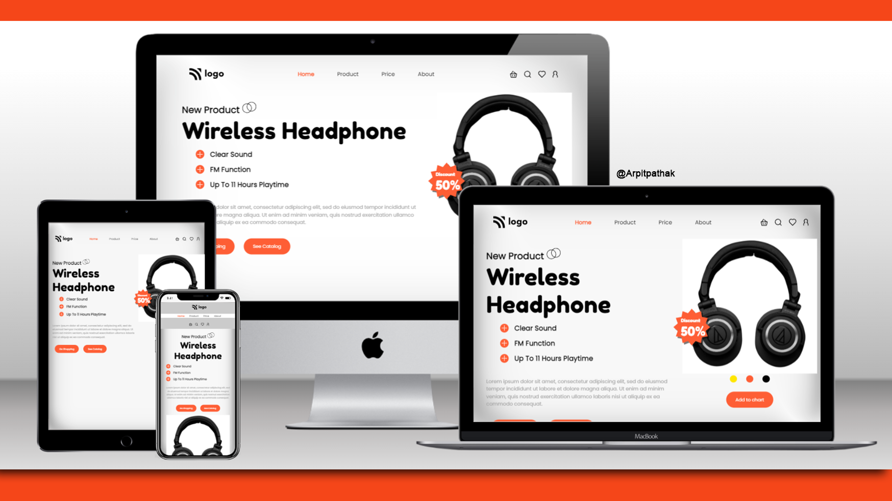

# Product Page (HeadPhone Brand Home Page)

## Project 07 🚀 Website's Live [Link](https://headphone-page.netlify.app/)🔗

>by Arpit Pathak

Screenshot

Website on different devices

Mobile view 📲

## What I learned from this Project? 

- Learned about the filter property "drop-shadow" to give shadow to svg files. I haven't used "box-shadow" property, Because it gives shadow to the whole svg file, and that is not what I want here.

- Learned about pseudo classes  :first-child and :last-child.
- Learned about Flexbox and its properties justify-content & align-items.
- Learned to select child element in html with the help of child doctor (>)

## Time taken to finish this project ⏳
- 3 hours + 35 min for making responsive
---

